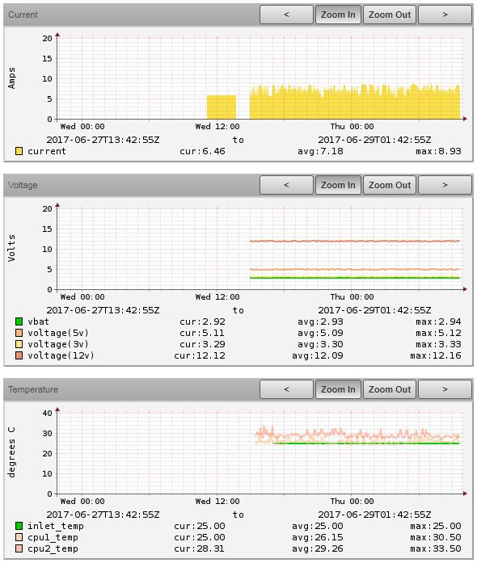

# ZenPacks.itri.IpmiMonitor

Monitor BMC power status of servers and other data using ipmitool.

## Configuration

Devices located in the `/Server/BMC` device class will automatically start
collecting BMC power status. For devices that are not in the `/Server/BMC` 
device class, a valid BMC IP address must be configured.

Additionally, valid ipmitool username and password credentials must be 
configured as well. All these configurations are handled through the following 
zProperties:

|       Name      |   Type   | Default | Category |    Description    |
|:---------------:|:--------:|:-------:|:--------:|:-----------------:|
| `zBmcAddress`   |  Boolean | False   | BMC      | BMC IP Address    |
| `zIpmiUsername` |  String  | `admin` | IPMI     | ipmitool username |
| `zIpmiPassword` | Password | `admin` | IPMI     | ipmitool password |

## Usage

After the ZenPack is installed, configure the `zBmcAddress` property for a 
specific device in the `/Server/Linux` or `/Server/SSH/Linux/NovaHost` device 
class.

The `BMC` monitoring template's data source plugin will then use this address to 
begin querying the BMC machine for the power status using ipmitool. The default 
cycle time is 30 seconds.

A power status indicator similar to the ping status indicator will be displayed 
in the device's page:

For devices located in `/Server/BMC`, ipmitool will be used as collection
method for *current*, *voltage*, *temperature*, and *power supply* data
sources:

## Dependencies

The following programs are required:

- ipmitool

The following ZenPacks are required:

- [ZenPacks.zenoss.ZenPackLib
v2](https://www.zenoss.com/product/zenpacks/zenpacklib)
- [ZenPacks.zenoss.PythonCollector](https://www.zenoss.com/product/zenpacks/pythoncollector)
- ZenPacks.itri.ServerMonitor v2+
